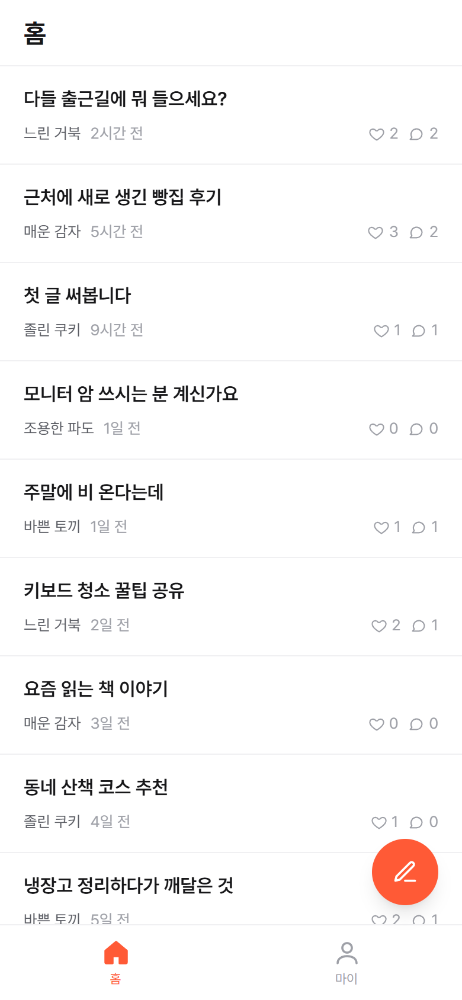
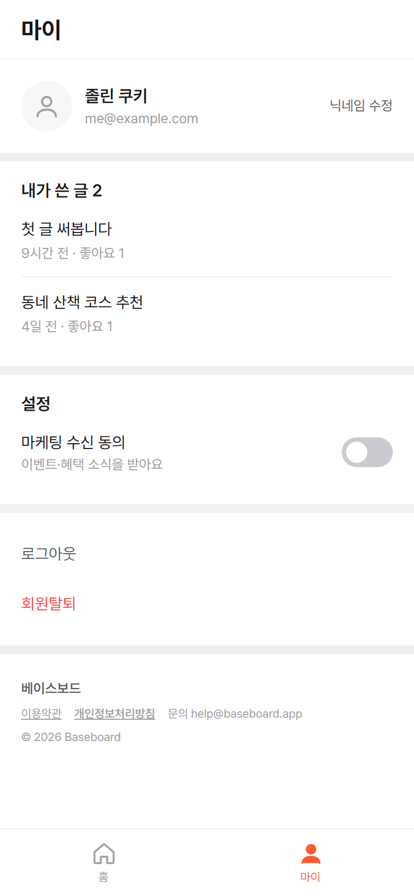
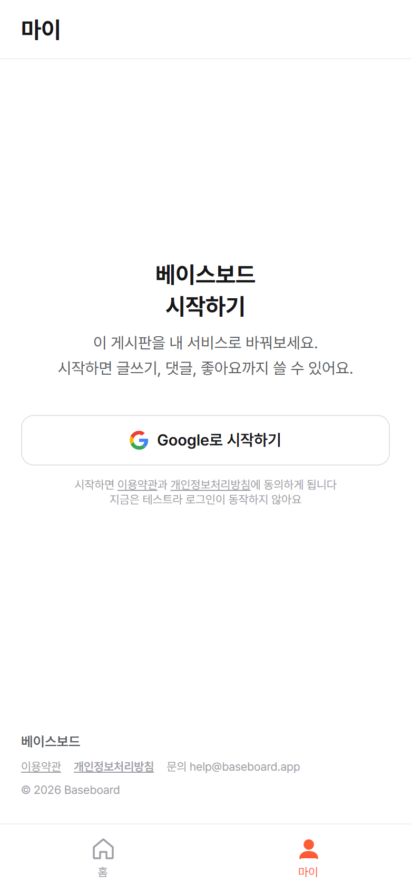
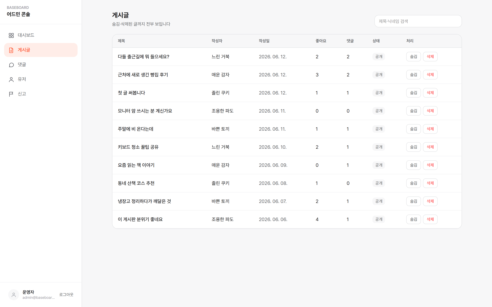

# vibecoding-baseboard (참고용 게시판 한 세트)

**기획서 3장**과 **그 기획서 그대로 구현된 게시판 앱**이 한 세트로 들어 있는 레포입니다. CRUD 게시판을 만들고 싶거나, 미니멀한 디자인 시스템이 필요할 때, Claude(코딩 AI)에게 **"이거 참고해봐"** 하고 던져주는 용도입니다. 실행해서 쓰는 완성품이 아니라, AI에게 보여주는 참고 자료입니다.

데모: https://vibecoding-baseboard.vercel.app (유저 앱) · https://vibecoding-baseboard.vercel.app/admin (어드민)

## 화면 미리보기

유저 앱 (홈 · 마이페이지 · 시작하기)

  

어드민 (게시글 관리)

## 들어 있는 것

- **기획서 2장** - 유저 화면은 어떻게 생겼고, 운영자 화면에선 뭘 할 수 있는지. 비개발자가 읽는 쉬운 문서 (`docs/001`, `docs/002`)
- **디자인 규칙 1장** - 색은 흰·회·검 + 포인트 1색, 글자는 6단계. 어디를 봐도 한 앱처럼 보이게 하는 규칙 (`docs/003`)
- **게시판 앱** - 위 문서를 그대로 구현한 것. 문서와 코드가 1:1로 맞아 있어서, AI가 "기획서의 이 문장이 코드의 이 부분"을 따라가며 응용할 수 있습니다 (`baseboard/`)

## 이것만 하시면 됩니다

**Claude Code에 이 페이지 주소를 주면서 "이거 참고해서 ○○ 만들고 싶어"라고 하세요.** 받아오는 것(클론)부터 알아서 해줍니다.

뭘 만들지 아직 막연해도 괜찮습니다. 이 레포에는 AI에게 주는 지침(`CLAUDE.md`)이 들어 있어서, AI가 인터뷰어가 되어 쉬운 질문으로 같이 정리해 줍니다 - 무엇을 올리는 서비스인지, 운영자 화면이 필요한지, 브랜드 색은 무엇인지.

## 바꾸고 싶으면

전부 말로 시키면 됩니다.

- **주제** - "게시판을 **동네 맛집 기록**으로 바꿔줘. 기획서부터 다시 쓰고 그대로 만들어줘"
- **색** - "포인트 색을 ○○로 바꿔줘" (앱 전체가 한 번에 바뀝니다)
- **디자인만** - "`docs/003` 디자인 규칙으로 내 화면을 다시 칠해줘"
- **어드민만** - "이 레포의 어드민 구조(목록·처리·신고)를 참고해서 내 서비스 어드민 만들어줘"
- **진짜 로그인·데이터** - "Supabase 연결해줘" / **인터넷에 올리기** - "Vercel로 배포해줘"

## 직접 돌려보고 싶으면

Claude Code에게 **"나 이거 다운로드 받았는데 켜줘"**라고 하세요. 켜지면 주소를 알려줍니다 - 유저 앱과 어드민(`/admin`)을 둘 다 열어보세요.

## 알아둘 것

- **일부러 아무것도 연결하지 않은 상태입니다.** 로그인은 가짜 버튼(누르면 가상 계정 "졸린 쿠키"로 시작), 데이터는 서버 메모리의 예시 데이터라 재시작하면 리셋됩니다. 데모에서 쓴 글이 어느 순간 사라지는 것도 같은 이유이고, 정상입니다.
- **진짜로 만들고 싶을 때의 연결 경로**: 구글 로그인·데이터 저장 → Supabase, 인터넷에 올리기 → Vercel. 키(열쇠 역할을 하는 문자열)를 AI에게 연결해 주면 설정을 대신 해줍니다. 한 번 연결해 두면 그 뒤로 훨씬 편합니다.
- 갈아끼울 파일은 `baseboard/src/lib/db.ts`(데이터)와 `baseboard/src/lib/auth.tsx`(로그인) 둘뿐입니다. 이 파일 이름을 몰라도 됩니다 - AI가 압니다.

## 크레딧

- **만든 곳** - AI 네이티브 https://ai-native.kr
- **Disclaimer** - 고정된 완성품이 아니라, 각자의 앱으로 바꿔 쓰는 출발점 템플릿입니다.
